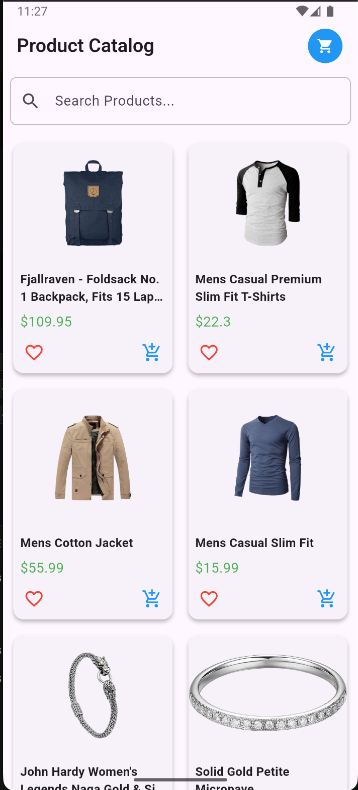
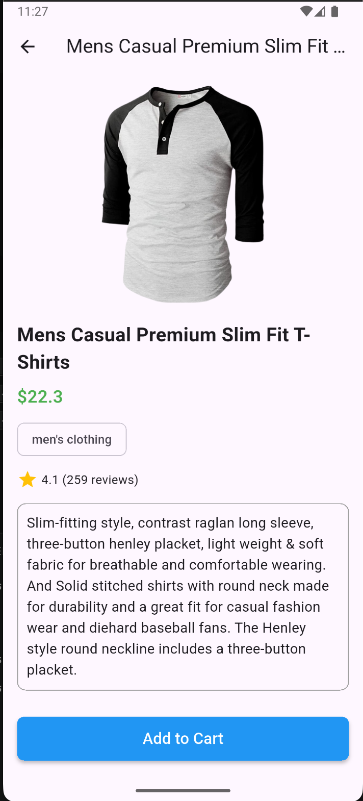
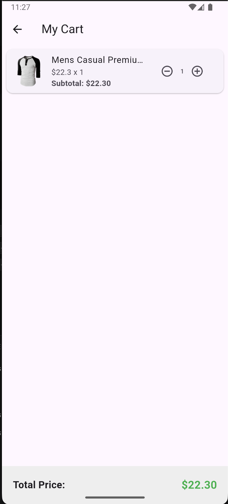

# Product Catalog with Local Cart 🛒

تطبيق فلاتر مخصص لعرض المنتجات وإدارتها داخل سلة تسوق محلية (Local Cart). تم بناؤه كجزء من مشروع/تاسك لإظهار مهارات التعامل مع واجهات المستخدم وإدارة البيانات محلياً.

---

## 📱 لقطات من التطبيق (Screenshots)

هنا يمكنك رؤية واجهات التطبيق الرئيسية:

| الواجهة الرئيسية (Home) | تفاصيل المنتج (Details) | سلة التسوق (Cart) |
| :---: | :---: | :---: |
|  |  |  |

---

## ✨ المميزات (Features)

* **كتالوج المنتجات:** عرض قائمة المنتجات بشكل منسق وجذاب.
* **تفاصيل المنتج:** صفحة مخصصة لكل منتج تعرض تفاصيله الكاملة.
* **سلة التسوق المحلية (Local Cart):** إضافة وحذف المنتجات، وتعديل الكميات مباشرة مع حساب الإجمالي.
* **إدارة الحالة (State Management):** تحديث فوري للواجهات عند تعديل السلة.

---

## 🛠️ التقنيات المستخدمة (Tech Stack)

* **Flutter & Dart**
* **State Management:** (اكتب هنا الأداة المستخدمة مثل Provider أو Bloc أو setState)
* **Local Storage:** (اكتب هنا طريقة الحفظ المحلية إذا استخدمت Shared Preferences أو Hive أو غيرها)

---

## 🚀 طريقة التشغيل (How to Run)

لتشغيل المشروع محلياً على جهازك، اتبع الخطوات التالية:

1. قم بعمل Clone للمستودع:
   ```bash
   git clone <رابط_المستودع_هنا>